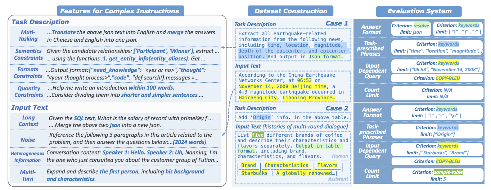

# CELLO

CELLO is a benchmark for evaluating the**C**ompl**E**x instruction understanding ability of **L**arge **L**anguage M**O**dels systematically (AAAI 2024).

- We design **eight features** for complex instructions and construct **a comprehensive evaluation dataset** from real-world scenarios.
- We establish **four criteria** and develop **corresponding metrics**, as current ones are inadequate, biased or too strict and coarse-grained.
- We compare the performance of representative **Chinese-oriented and English-oriented models** in following complex instructions through extensive experiments.

<p align="center">
    <br>
    
    <br>
</p>

## Install Dependencies

```
conda create -n cello python=3.10.9
conda activate cello
conda install pytorch==1.13.1 torchvision==0.14.1 torchaudio==0.13.1 pytorch-cuda=11.7 -c pytorch -c nvidia
pip install -r requirements.txt
```

## Evaluate Models

You can evaluate any desired model via the following scirpt `eval.sh`:

```
cd CELLO/
CUDA_VISIBLE_DEVICES=0 python code/eval.py --model_name chatglm --save_name chatglm
```

All the models are implemented in the folder [code/evaluators](code/evaluators/).
All the model results are in the folder [results/](results/).

## Scoring System

The metrics for our designed four criteria can be calculated using the following script  `score.sh`:

```
cd CELLO/
python code/score.py
```

All the scorers are implemented in the folder [code/scorers](code/scorers/).
All the scoring results are in the folder [scores/](scores/).

## Data

The collected data can be found in the [data/](data/). All samples have been anonymized.

## Citation

```
@inproceedings{he2024can,
  title={Can Large Language Models Understand Real-World Complex Instructions?},
  author={He, Qianyu and Zeng, Jie and Huang, Wenhao and Chen, Lina and Xiao, Jin and He, Qianxi and Zhou, Xunzhe and Liang, Jiaqing and Xiao, Yanghua},
  booktitle={Proceedings of the AAAI Conference on Artificial Intelligence},
  volume={38},
  number={16},
  pages={18188--18196},
  year={2024}
}
```
